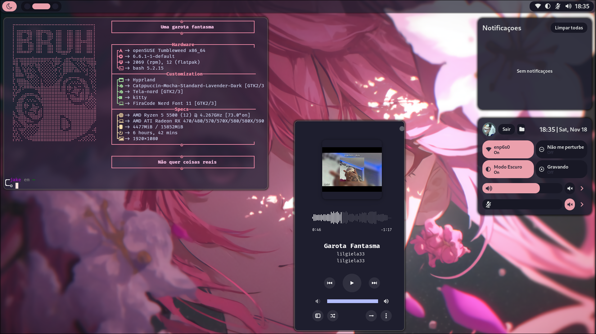

# Hyprland Dots




> My Personal Dots for Hyprland with OpenSUSE

## Dependencies

Before you begin, make sure you've met the following requirements:

* Check if you have `Eww, Kitty, Rofi, Playerctl, socat, EasyEffects and BD`

## 🚀 Cloning the Repository
To the download the repository follow these steps

```
git clone https://github.com/JakeMartinezz/hyprland-dots.git
```

## 📫 Contribute to the Dots!
To contribute follow these steps


1. Fork the repositry
2. Create a Branch: `git checkout -b main`
3. Make the changes: `git commit -m 'Seu commit'`
4. Push to the original branch: `git push origin shell-suse / local`
5. Make a pull.

Alternatively, see the GitHub documentation at [how to create a pull request](https://help.github.com/en/github/collaborating-with-issues-and-pull-requests/creating-a-pull-request).

